<!-- PROJECT SHIELDS -->
[![NPM Version][npm-shield]][npm-url]
[![PyPI Version][pypi-shield]][pypi-url]
[![Stargazers][stars-shield]][stars-url]
[![Issues][issues-shield]][issues-url]
[![Website][website-shield]][website-url]

<!-- PROJECT LOGO -->
<br />
<p align="center">
  <a href="https://videodb.io/">
    
  </a>

  <h3 align="center">VideoDB Capture SDK</h3>

  <p align="center">
    Give your AI eyes and ears — capture and understand what's happening on any desktop in real-time.
    <br />
    <a href="https://docs.videodb.io"><strong>Explore the docs »</strong></a>
    <br />
    <br />
    <a href="#-what-you-can-build">View Examples</a>
    ·
    <a href="#-quick-start">Quick Start</a>
    ·
    <a href="https://github.com/video-db/videodb-capture-quickstart/issues">Report Bug</a>
  </p>
</p>

---

## Table of Contents

- [What is VideoDB Capture?](#what-is-videodb-capture)
- [What You Can Build](#-what-you-can-build)
- [Architecture](#architecture)
- [Core Concepts](#core-concepts)
- [What You Get](#what-you-get)
- [Installation](#installation)
- [Prerequisites](#prerequisites)
- [Quick Start](#-quick-start)
- [Community & Support](#community--support)

---

## What is VideoDB Capture?

A real-time desktop capture SDK that lets your AI see and hear what's happening on a user's screen.

**The problem:** Traditional screen recording creates video files. You can't query them, search them, or get insights until recording stops.

**Our solution:** Stream screen, mic, and system audio to the cloud → run AI processing in real-time → receive structured events (transcripts, visual descriptions, semantic indexes) in under 2 seconds.

**How it works:**
- Your backend creates sessions and mints short-lived tokens (API key stays secure on server)
- Desktop client streams media using the token (never sees your API key)
- VideoDB Cloud runs AI processing and delivers events via webhooks + WebSocket
- You control what AI pipelines to run (transcription, visual indexing, audio indexing)

## 🎬 What You Can Build

**The flow:** Backend creates session & token → Desktop streams media → Webhooks trigger AI → You get live events

### Featured Applications

Each app below is fully functional and can be run locally. They demonstrate different use cases:

| App | Use Case | What It Does | Tech Stack |
|-----|----------|--------------|------------|
| **[Pair Programmer](./apps/claude/pair-programmer/README.md)** | 🤖 AI Coding Assistant | Claude Code watches your screen and hears your audio. Hit `Cmd+Shift+A` and ask "what's that error?" — it reads your terminal and answers instantly. | Electron, Node.js, Claude Code |
| **[Focusd](./apps/electron/focusd-productivity-tracker/README.md)** | 📊 Productivity Tracking | Records your screen all day, understands what you're working on, generates session summaries and daily recaps with actionable insights. | Electron, React, TypeScript, SQLite |
| **[Sales Copilot](./apps/electron/sales-copilot/README.md)** | 💼 Sales Coaching | Real-time cue cards, sentiment tracking, talk ratio monitoring, and post-call summaries during sales calls. | Electron, React, TypeScript, tRPC |

### More Examples

| App | Description |
|-----|-------------|
| [Meeting Copilot](./apps/electron/meeting-copilot) | 📞 Live meeting transcription and AI insights |
| [Loom Clone](./apps/electron/loom-electron) | 🎥 Async video recorder with camera bubble |
| [Resonant AI](./apps/electron/resonant-ai-recommender) | 🔍 Content recommender from screen context |
| [Node.js Quickstart](./apps/quickstart/node-quickstart) | ⚡ Minimal example to get started fast |
| [Python Quickstart](./apps/quickstart/python-quickstart) | 🐍 Python version of quickstart |

> 💡 **New to VideoDB?** Start with the [Node.js Quickstart](./apps/quickstart/node-quickstart) or [Python Quickstart](./apps/quickstart/python-quickstart) to understand the basics, then explore the featured apps.

## Architecture

```mermaid
flowchart TB
    subgraph Backend["🔐 Your Backend"]
        B1[Create Session]
        B2[Mint Token]
        B3[Receive Webhooks]
        B4["Start AI Pipelines"]
        B5["WebSocket Listener"]
    end

    subgraph Client["🖥️ Desktop Client"]
        C1["CaptureClient"]
        C2["Channels:<br/>mic · system_audio · display"]
    end

    subgraph VDB["☁️ VideoDB Cloud"]
        V1[Session Manager]
        V2["RTStreams<br/>(one per channel)"]
        V3["AI Processing"]
    end

    B1 --> V1
    B2 -->|short-lived token| C1
    C1 --> C2 -->|media streams| V2
    V1 -->|"Webhooks (durable)"| B3
    B3 --> B4 --> V3
    V3 -->|"WebSocket (live)"| B5
```



**Key insight:** You control the AI. When you get the `capture_session.active` webhook, you decide which RTStreams to process and what prompts to use.

## Core Concepts

- **Backend**: Creating sessions & minting tokens (secure, server-side)
- **Desktop Client**: Capturing & streaming media (client-side, uses session token)
- **Control Plane**: Webhooks for durable session lifecycle events (`active`, `stopped`, `exported`)
- **Realtime Plane**: WebSockets for live transcripts, indexes, and UI updates
- **CaptureSession** (`cap-xxx`): Container for one capture run
- **RTStream** (`rts-xxx`): Real-time stream per channel where you start AI pipelines
- **Channel**: Recordable source like `mic:default`, `system_audio:default`, `display:1`

## What You Get

Your backend receives real-time structured events:

```json
{"channel": "transcript", "data": {"text": "Let's schedule the meeting for Thursday", "is_final": true}}
{"channel": "scene_index", "data": {"text": "User is viewing a Slack conversation..."}}
{"channel": "audio_index", "data": {"text": "Discussion about scheduling a team meeting"}}
```

All events include timestamps. Build timelines, search past moments, or trigger actions in real-time.

## Installation

```bash
# Node.js
npm install videodb

# Python
pip install "videodb[capture]"
```

## Prerequisites

1. **Get an API Key**: Sign up at [console.videodb.io](https://console.videodb.io)
2. **Set Environment Variable**: `export VIDEO_DB_API_KEY=your_api_key`

## 🚀 Quick Start

The SDK works in a 4-step flow:

### Step 1: Backend Creates Session

#### Node.js
```javascript
import { connect } from 'videodb';
const conn = connect();

const session = await conn.createCaptureSession({
  endUserId: "user_abc",
  callbackUrl: "https://your-backend.com/webhooks/videodb"
});

const token = await conn.generateClientToken(600);
console.log({ sessionId: session.id, token });
```

#### Python
```python
import videodb
conn = videodb.connect()

session = conn.create_capture_session(
    end_user_id="user_abc",
    callback_url="https://your-backend.com/webhooks/videodb"
)

token = conn.generate_client_token(expires_in=600)
print(f"Session: {session.id}, Token: {token}")
```

### Step 2: Desktop Starts Capture

The desktop client uses the token to stream media. It never sees your API key.

#### Node.js
```javascript
import { CaptureClient } from 'videodb/capture';

const client = new CaptureClient({ sessionToken: token });

await client.requestPermission('microphone');
await client.requestPermission('screen-capture');

const channels = await client.listChannels();
await client.startCaptureSession({
  sessionId: session.id,
  channels: [
    channels.find(c => c.channelId === 'mic:default'),
    channels.find(c => c.type === 'video')
  ]
});
```

#### Python
```python
import asyncio
from videodb.capture import CaptureClient

async def main():
    client = CaptureClient(client_token=token)

    await client.request_permission("microphone")
    await client.request_permission("screen_capture")

    channels = await client.channels()
    await client.start_capture_session(
        capture_session_id=session.id,
        channels=[channels.mics.default, channels.displays.primary],
        primary_video_channel_id=channels.displays.primary.name
    )

asyncio.run(main())
```

### Step 3: Backend Triggers AI Pipelines

VideoDB sends webhooks when the session is active. Use this to start AI processing.

#### Node.js
```javascript
// Webhook handler: Start AI on active streams
if (payload.event === "capture_session.active") {
  const cap = await conn.getCaptureSession(payload.capture_session_id);

  // Start transcription on mic
  const mic = cap.getRtstream("mics")[0];
  await mic.startTranscript();
  await mic.indexAudio({ prompt: "Extract action items" });

  // Start visual indexing on screen
  const screen = cap.getRtstream("displays")[0];
  await screen.indexVisuals({ prompt: "Describe screen activity" });
}
```

#### Python
```python
# Webhook handler: Start AI on active streams
if payload["event"] == "capture_session.active":
    cap = conn.get_capture_session(payload["capture_session_id"])

    # Start transcription on mic
    if mics := cap.get_rtstream("mics"):
        mics[0].start_transcript()
        mics[0].index_audio(prompt="Extract action items")

    # Start visual indexing on screen
    if displays := cap.get_rtstream("displays"):
        displays[0].index_visuals(prompt="Describe screen activity")
```

### Step 4: Backend Receives Live Events

Connect via WebSocket to consume real-time transcripts and insights.

#### Node.js
```javascript
const ws = await conn.connectWebsocket();
await ws.connect();

// Receive live events
for await (const ev of ws.receive()) {
  if (ev.channel === "transcript") {
    console.log(`Transcript: ${ev.data.text}`);
  }
}
```

#### Python
```python
ws = conn.connect_websocket()
await ws.connect()

# Receive live events
async for ev in ws.stream():
    if ev["channel"] == "transcript":
        print(f"Transcript: {ev['data']['text']}")
```

## Community & Support

- **Docs**: [docs.videodb.io](https://docs.videodb.io)
- **Issues**: [GitHub Issues](https://github.com/video-db/videodb-capture-quickstart/issues)
- **Discord**: [Join community](https://discord.gg/py9P639jGz)
- **Console**: [Get API key](https://console.videodb.io)

---

<p align="center">Made with ❤️ by the <a href="https://videodb.io">VideoDB</a> team</p>

---

<!-- MARKDOWN LINKS & IMAGES -->
[npm-shield]: https://img.shields.io/npm/v/videodb?style=for-the-badge
[npm-url]: https://www.npmjs.com/package/videodb
[pypi-shield]: https://img.shields.io/pypi/v/videodb?style=for-the-badge
[pypi-url]: https://pypi.org/project/videodb/
[stars-shield]: https://img.shields.io/github/stars/video-db/videodb-capture-quickstart.svg?style=for-the-badge
[stars-url]: https://github.com/video-db/videodb-capture-quickstart/stargazers
[issues-shield]: https://img.shields.io/github/issues/video-db/videodb-capture-quickstart.svg?style=for-the-badge
[issues-url]: https://github.com/video-db/videodb-capture-quickstart/issues
[website-shield]: https://img.shields.io/website?url=https%3A%2F%2Fvideodb.io%2F&style=for-the-badge&label=videodb.io
[website-url]: https://videodb.io/
