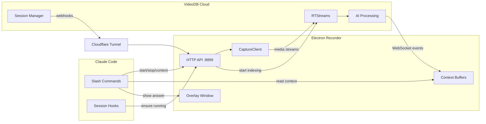

<h1 align="center">Pair Programmer</h1>

<p align="center">
  AI pair programming with real-time screen and audio context — powered by <a href="https://videodb.io">VideoDB</a> and <a href="https://docs.anthropic.com/en/docs/claude-code">Claude Code</a>.
</p>

---

## Overview

Pair Programmer turns Claude Code into a context-aware assistant that can see your screen and hear your audio in real-time. An Electron-based recorder runs in the background, captures your display, microphone, and system audio, and streams everything to VideoDB for indexing. Claude Code reads the indexed context on demand through slash commands, so it always knows what you're looking at, what you just discussed, and what happened in the last few minutes.

The recorder exposes a local HTTP API that Claude Code talks to via hooks and commands. A Cloudflare tunnel is automatically created so VideoDB can deliver webhooks back to your machine. No manual ngrok setup required.

## How It Works

1. **Session hook starts the recorder** — When you open Claude Code in the project directory, a session hook (`ensure-recorder.sh`) checks config and starts the Electron recorder process if needed.
2. **`/record` begins capture** — The slash command calls the recorder's HTTP API to start a VideoDB capture session with mic, system audio, and display channels.
3. **Webhooks activate AI pipelines** — VideoDB sends a `capture_session.active` webhook. The recorder starts transcript, visual indexing, and audio indexing on each RTStream.
4. **Context buffers fill in real-time** — Indexed events (screen descriptions, transcripts, audio summaries) arrive via WebSocket and are stored in FIFO context buffers.
5. **`/refresh-context` or `/what-happened` reads the buffer** — Claude Code fetches the latest context from the recorder's HTTP API and builds a timestamped summary.
6. **`Cmd+Shift+A` triggers instant answers** — A global keyboard shortcut spawns a `/trigger` command that reads context and shows the answer in an always-on-top overlay, without interrupting your workflow.

## Architecture



## Tech Stack

| Component | Version | Purpose |
|-----------|---------|---------|
| Electron | 28 | Desktop application shell |
| Node.js | 18+ | JavaScript runtime |
| VideoDB SDK | Latest | Screen capture and AI indexing |
| Cloudflare Tunnel | Latest | Webhook delivery to localhost |

## Slash Commands

| Command | Description |
|---------|-------------|
| `/record` | Start or stop a recording session. Runs `/record-config` first if setup is incomplete. |
| `/record-status` | Show current recording state, active channels, RTStream IDs, and buffer sizes. |
| `/refresh-context` | Fetch the latest screen, mic, and audio context and display a timestamped timeline. |
| `/what-happened` | Fetch context and provide an analysis with timeline, key actions, current state, and notable items. |
| `/record-config` | Set up or update your VideoDB API key, indexing prompts, and recorder settings. |
| `/trigger` | Activated by the global shortcut (`Cmd+Shift+A`). Reads context, analyzes it, and shows the answer in the overlay. |

## Prerequisites

- **Operating System**: macOS (Apple Silicon or Intel)
- **Node.js**: 18 or higher
- **npm**: 10 or higher
- **Claude Code CLI**: [Install here](https://docs.anthropic.com/en/docs/claude-code)
- **VideoDB API Key**: Sign up at [console.videodb.io](https://console.videodb.io)

## Getting Started

```bash
# 1. Clone the repository
git clone https://github.com/video-db/videodb-capture-quickstart.git
cd videodb-capture-quickstart/apps/claude/pair-programmer

# 2. Open Claude Code
claude

# 3. Configure your API key and settings
/record-config

# 4. Start recording
/record
```

The `/record-config` command will prompt you for your VideoDB API key and save it locally. The recorder process starts automatically when you open Claude Code (via session hooks) or when you run `/record`.

## Configuration

Settings are stored in `.claude/skills/pair-programmer/config.json`. Key options:

| Setting | Default | Description |
|---------|---------|-------------|
| `videodb_api_key` | — | Your VideoDB API key (stored locally, masked in output) |
| `recorder_port` | `8899` | Port for the recorder's HTTP API |
| `context_buffer_size_screen` | `50` | Max screen context entries to keep in memory |
| `context_buffer_size_mic` | `50` | Max mic context entries |
| `context_buffer_size_system_audio` | `50` | Max system audio context entries |
| `assistant_shortcut` | `CommandOrControl+Shift+A` | Global keyboard shortcut for `/trigger` |
| `visual_index.prompt` | Screen description prompt | What the vision model extracts from screen captures |
| `visual_index.batch_time` | `2` | Seconds between visual index batches |
| `system_audio_index.prompt` | Audio summary prompt | What the model extracts from system audio |
| `mic_index.prompt` | Transcription prompt | What the model extracts from mic audio |

All indexing settings (prompts, batch timing, enable/disable) can be adjusted via `/record-config`.

## Project Structure

```
apps/claude/pair-programmer/
├── .claude/
│   ├── settings.json              # Session hooks configuration
│   ├── commands/
│   │   ├── record.md              # /record command
│   │   ├── record-config.md       # /record-config command
│   │   ├── record-status.md       # /record-status command
│   │   ├── refresh-context.md     # /refresh-context command
│   │   ├── what-happened.md       # /what-happened command
│   │   └── trigger.md             # /trigger command (shortcut)
│   ├── hooks/
│   │   ├── ensure-recorder.sh     # Auto-start recorder on session start
│   │   ├── start-recorder.sh      # Manual recorder startup
│   │   └── cleanup-recorder.sh    # Stop recorder on session end
│   └── skills/
│       └── pair-programmer/
│           ├── skill.md            # HTTP API reference for Claude
│           ├── config.json         # User configuration
│           ├── package.json        # Dependencies (Electron 28, VideoDB SDK)
│           ├── recorder-app.js     # Electron recorder application (1,671 lines)
│           └── ui/
│               ├── overlay.html    # Always-on-top overlay window
│               └── picker.html     # Display/audio source picker
├── .gitignore
└── README.md
```

## Permissions (macOS)

The recorder requires the following system permissions:
- **Microphone Access** - For voice recording
- **Screen Recording** - For screen capture
- **System Audio Recording** - For capturing system audio

Grant these in **System Settings > Privacy & Security**.

## Troubleshooting

### Recorder won't start
- Check that Node.js 18+ is installed: `node --version`
- Verify VideoDB API key is set: `/record-config`
- Check for port conflicts on 8899: `lsof -i :8899`

### No context appearing
- Ensure recording is active: `/record-status`
- Check that indexing pipelines are enabled in config
- Wait 10-15 seconds for initial context to populate

### Overlay not showing
- Verify keyboard shortcut isn't conflicting with other apps
- Check System Settings > Privacy & Security > Accessibility permissions
- Try changing the shortcut in `/record-config`

### Cloudflare tunnel fails
- The tunnel binary will auto-download on first run
- Check internet connectivity
- Manually verify tunnel status in recorder logs

## Data & Privacy

- Your **API key** is stored locally in `config.json` and never leaves your machine except to authenticate with VideoDB's API.
- **Screen captures** are streamed to VideoDB for indexing, and indexed context is stored in ephemeral in-memory buffers on your machine.
- **Context buffers** are FIFO queues — old entries are dropped as new ones arrive. Nothing is written to disk.
- The recorder process runs locally and communicates with Claude Code over `localhost`.
- A **Cloudflare tunnel** is created automatically for webhook delivery and is torn down when the recorder stops.

## License

MIT - See [repository license](https://github.com/video-db/videodb-capture-quickstart/blob/main/LICENSE)
