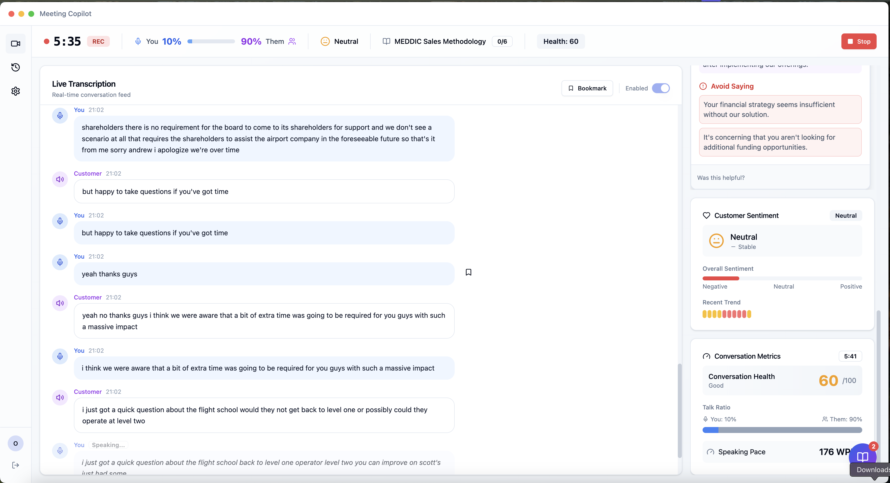
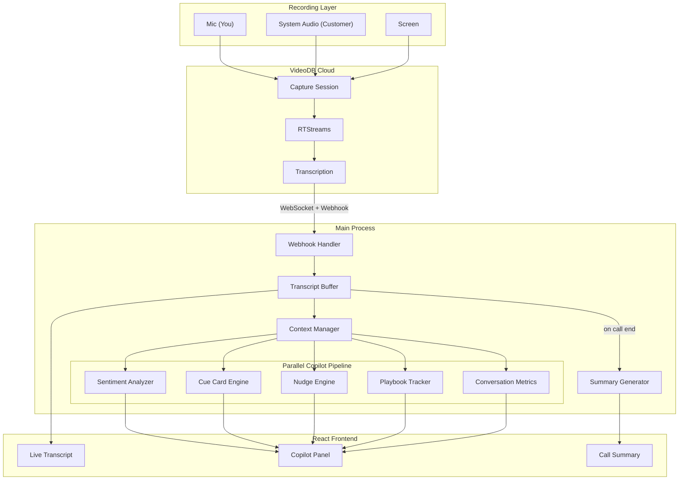

<h1 align="center">Sales Copilot</h1>

<p align="center">
  Real-time AI sales call assistant with live transcription, sentiment analysis, cue cards, and post-call summaries — powered by <a href="https://videodb.io">VideoDB</a>.
</p>

---



## Overview

Sales Copilot records your sales calls and provides real-time coaching while you talk. It captures screen, microphone, and system audio through VideoDB's capture SDK, runs dual-channel transcription (your mic vs. customer's system audio), and feeds the conversation into a parallel analysis pipeline that produces sentiment scores, cue cards, nudges, talk ratio monitoring, and playbook tracking — all updated live during the call. When the call ends, it generates a structured summary with action items, objections, and risk assessment.

## Features

### Recording & Transcription
- **Screen & Audio Recording** - Capture screen, microphone, and system audio simultaneously
- **Real-time Transcription** - Live speech-to-text powered by VideoDB
- **Recording History** - Browse and review past recordings with full transcripts

### AI Sales Copilot
- **Cue Cards** - Context-aware prompts and talking points based on conversation
- **Sentiment Analysis** - Track customer sentiment throughout the call
- **Conversation Metrics** - Monitor talk ratio, speaking pace, questions asked, and more
- **Playbook Tracking** - Ensure you cover all discovery questions with progress tracking
- **Nudges** - Timely reminders based on conversation context (e.g., "You haven't asked about budget")
- **Call Summary** - AI-generated summary with key points, action items, objections, and risks
- **Bookmarking** - Mark important moments during calls for easy reference
- **MCP Agent Support** - Connect MCP servers and let the app auto-trigger tool calls from conversation context
- **MCP Result Cards** - Inline tool outputs (including links) shown live during calls

### Technical
- **Modern UI** - Built with React, Tailwind CSS, and shadcn/ui
- **Type-safe API** - End-to-end type safety with tRPC
- **Local Database** - SQLite with Drizzle ORM for offline-first storage
- **Secure Webhooks** - Cloudflare tunnel for receiving real-time transcription events

## Architecture



## How the Copilot Works

The copilot pipeline processes conversation in real-time through several parallel analyzers:

- **Dual-channel transcription** — Mic is labeled as "you" (the rep), system audio as the customer. This separation powers all downstream analysis.
- **Sentiment analysis** — Tracks customer sentiment using pattern-based detection and optional LLM analysis. Sentiment is scored per transcript segment and trended over time.
- **Talk ratio monitoring** — Calculates the balance between rep and customer speaking time. Alerts when ratio drifts outside the ideal 40-60% range.
- **Cue card engine** — Detects objection types (pricing, competition, timing, authority) from customer speech and surfaces matching response suggestions in real-time.
- **Nudge engine** — Generates contextual alerts: monologue warnings when you've been talking too long, sentiment dip alerts when customer tone drops, and ratio alerts when conversation is one-sided.
- **Playbook tracker** — Tracks which discovery questions from your playbook have been covered, showing completion percentage and highlighting gaps.
- **Post-call summary** — When the call ends, runs parallel extraction of action items, objections raised, competitive mentions, risks identified, and next steps.

## Tech Stack

- **Electron 34** - Desktop application shell
- **TypeScript 5.8** - Full type coverage
- **React 19** - Modern UI framework
- **Tailwind CSS** - Utility-first styling with Geist font
- **shadcn/ui** - High-quality component primitives
- **tRPC 11** - Type-safe API layer
- **Hono** - Fast HTTP server for webhooks
- **Drizzle ORM** - Type-safe database operations
- **Zustand** - Lightweight state management
- **Vite** - Fast frontend bundling
- **VideoDB SDK** - Screen recording and transcription (includes OpenAI-compatible API for LLM calls)

## Prerequisites

- **Operating System**: macOS 12+ (for screen recording features)
- **Node.js**: 18 or higher
- **npm**: 10 or higher
- **VideoDB API Key**: Sign up at [console.videodb.io](https://console.videodb.io)

## Getting Started

1. **Clone the repository:**
   ```bash
   git clone https://github.com/video-db/videodb-capture-quickstart.git
   cd videodb-capture-quickstart/apps/electron/sales-copilot
   ```

2. **Install dependencies:**
   ```bash
   npm install
   ```

3. **Rebuild native modules for Electron:**
   ```bash
   npm run rebuild
   ```

4. **Start development mode:**
   ```bash
   npm run dev
   ```

5. **Register with your VideoDB API key** when the app opens

## MCP Server Setup

### Where to Configure

Open **Settings → MCP Servers** in the app.

### How to Add a Server

1. Click **Add Server**
2. Choose transport:
   - **stdio** (local command-based MCP server)
   - **http** (remote MCP endpoint)
3. Fill required fields (command/args/env or URL/headers)
4. Save and click **Connect**

### Triggering Behavior

- MCP agent runs automatically during active calls when trigger keywords are detected in transcript context.
- You can customize trigger keywords from the MCP settings panel.
- Tool outputs appear in the **MCP Results** panel during the call.

### Capabilities

- Multiple MCP server connections
- Aggregated tool discovery across connected servers
- Auto-triggered tool execution from call context
- Live MCP result rendering (cards, markdown, links, structured fields)
- Result actions like pin/dismiss while in-call

## Development

### Available Scripts

| Command | Description |
|---------|-------------|
| `npm run dev` | Start development mode (main + renderer) |
| `npm run build` | Build for production |
| `npm run typecheck` | Run TypeScript type checking |
| `npm run lint` | Run ESLint |
| `npm run rebuild` | Rebuild native modules for Electron |
| `npm run db:generate` | Generate database migration files |
| `npm run db:migrate` | Apply database migrations |

### Project Structure

```
src/
├── main/                   # Electron Main Process
│   ├── db/                 # Database layer (Drizzle + SQLite)
│   ├── ipc/                # IPC handlers
│   ├── lib/                # Utilities (logger, paths, permissions)
│   ├── server/             # HTTP server (Hono + tRPC)
│   │   ├── routes/         # Webhook routes
│   │   └── trpc/           # tRPC router and procedures
│   └── services/           # Business logic
│       ├── copilot/        # AI copilot services
│       │   ├── context-manager.service.ts
│       │   ├── conversation-metrics.service.ts
│       │   ├── cue-card-engine.service.ts
│       │   ├── nudge-engine.service.ts
│       │   ├── playbook-tracker.service.ts
│       │   ├── sales-copilot.service.ts
│       │   ├── sentiment-analyzer.service.ts
│       │   ├── summary-generator.service.ts
│       │   └── transcript-buffer.service.ts
│       ├── llm.service.ts
│       ├── mcp/            # MCP orchestration and tool execution services
│       ├── tunnel.service.ts
│       └── videodb.service.ts
├── preload/                # Preload scripts (IPC bridge)
├── renderer/               # React Frontend
│   ├── api/                # tRPC client
│   ├── components/         # UI components
│   │   ├── auth/           # Authentication modal
│   │   ├── copilot/        # Copilot UI components
│   │   ├── history/        # Recording history views
│   │   ├── layout/         # App layout (sidebar, titlebar)
│   │   ├── mcp/            # MCP results/status components
│   │   ├── recording/      # Recording controls
│   │   ├── settings/       # Settings editors
│   │   ├── transcription/  # Live transcription panel
│   │   └── ui/             # shadcn/ui components
│   ├── hooks/              # Custom React hooks
│   ├── lib/                # Utilities
│   └── stores/             # Zustand state stores (session, copilot, mcp)
└── shared/                 # Shared types & schemas
    ├── schemas/            # Zod validation schemas
    └── types/              # TypeScript types
```

## Permissions (macOS)

The app requires the following permissions:
- **Microphone** - For voice recording
- **Screen Recording** - For screen capture

Grant these in **System Preferences > Privacy & Security**.

## Troubleshooting

### Recording not starting
- Verify VideoDB API key is registered (enter via registration modal on first launch)
- Check microphone and screen recording permissions in System Settings
- Try `npm run rebuild` to rebuild native modules

### Transcription not appearing
- Ensure both mic and system audio are enabled in recording settings
- Check that the Cloudflare tunnel is active (shown in recording status)
- Wait 5-10 seconds for first transcripts to appear

### Copilot features not updating
- Verify that transcription is working first
- Check that at least 2-3 transcript segments exist
- Some features (cue cards, nudges) require specific conversation patterns

### Build/Installation issues
- Delete `node_modules` and reinstall: `rm -rf node_modules && npm install`
- Rebuild native modules: `npm run rebuild`
- Check Node.js version: `node --version` (requires 18+)
- Review logs in `~/Library/Application Support/sales-copilot/logs/`

### Webhook delivery fails
- Cloudflare tunnel auto-creates on recording start
- Check internet connectivity
- Restart the recording to reinitialize tunnel

## Data Storage

Application data is stored in:
```
~/Library/Application Support/sales-copilot/
├── data/
│   └── sales-copilot.db    # SQLite database
└── logs/
    └── app-YYYY-MM-DD.log  # Daily log files
```

## Architecture

### API Layer (tRPC + Hono)

The embedded HTTP server uses Hono for the web framework and tRPC for type-safe API endpoints:

- `/api/trpc/*` - tRPC endpoints for app operations
- `/api/webhook` - Raw Hono route for VideoDB webhooks

### State Management

- **Zustand** stores for client-side state (session, config, transcription, copilot)
- **React Query** for server state caching via tRPC

### IPC Communication

Type-safe IPC between renderer and main process:
- `window.electronAPI.capture.*` - Recording controls
- `window.electronAPI.permissions.*` - Permission management
- `window.electronAPI.copilot.*` - Copilot operations
- `window.electronAPI.mcp.*` - MCP server and tool operations
- `window.electronAPI.mcpOn.*` - MCP event subscriptions
- `window.electronAPI.app.*` - App utilities

### AI Copilot Pipeline

1. **Transcript Buffer** - Accumulates transcript segments
2. **Context Manager** - Maintains conversation context for LLM
3. **Parallel Analysis:**
   - Sentiment Analyzer - Detects customer sentiment
   - Cue Card Engine - Triggers relevant cue cards
   - Nudge Engine - Generates contextual nudges
   - Playbook Tracker - Tracks discovery progress
   - Conversation Metrics - Calculates talk ratio, pace, etc.
4. **Summary Generator** - Creates call summary on end

## License

MIT - See [repository license](https://github.com/video-db/videodb-capture-quickstart/blob/main/LICENSE)
