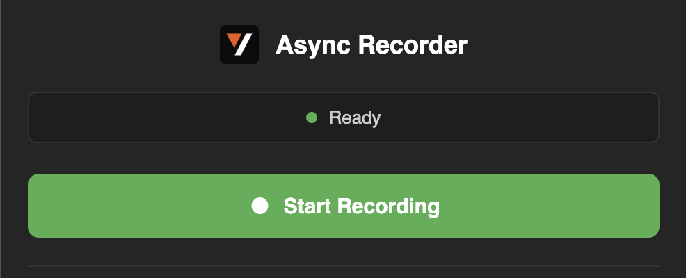
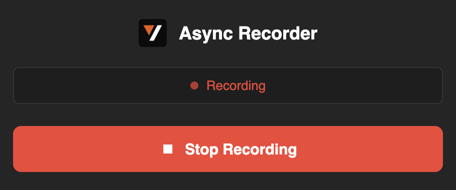
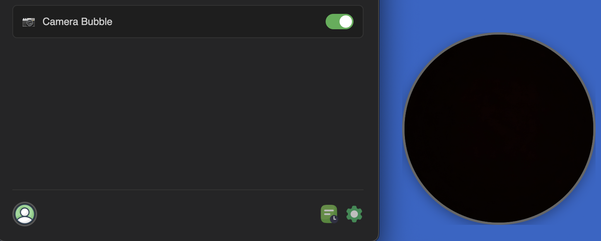
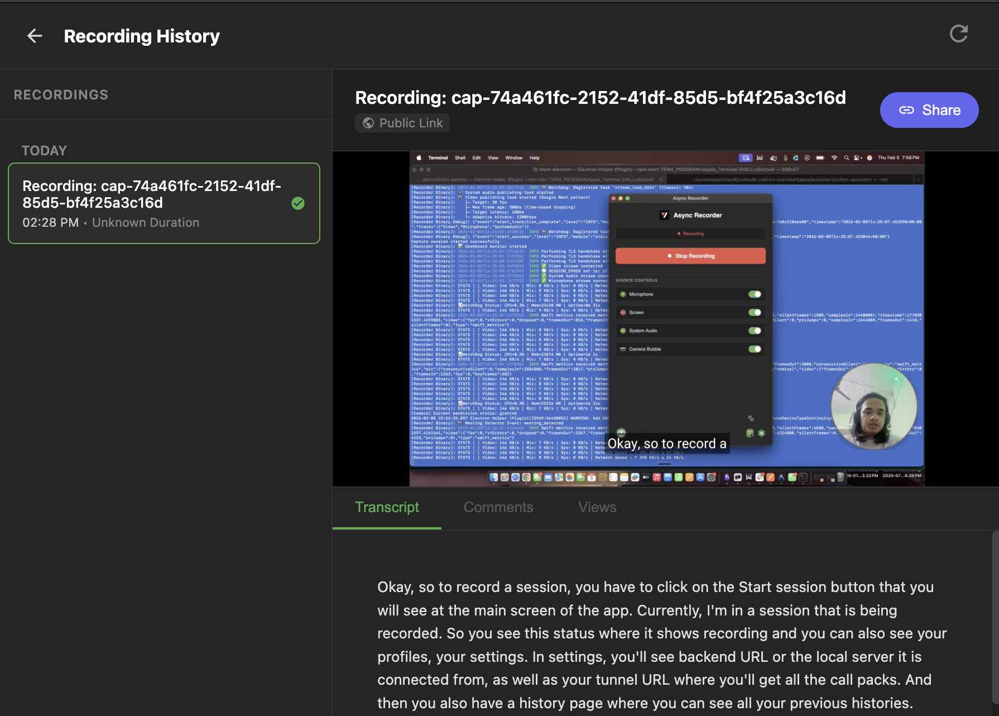

# Async Recorder

A Loom-style screen recording app built with Electron and the VideoDB Capture SDK.

> **Platform Support**: macOS and Windows

## Features

- Screen + microphone + system audio capture
- Draggable camera bubble overlay
- In-app video playback
- Recording history with search
- Auto-indexing for searchable recordings

## Screenshots

| Main Window | Recording |
|-------------|-----------|
|  |  |

| Camera Bubble | History |
|---------------|---------|
|  |  |

## Prerequisites

- Node.js 16+
- Python 3.10+ ([download](https://python.org/downloads/))
- VideoDB API Key ([console.videodb.io](https://console.videodb.io))

## Quick Start

```bash
npm install
npm run setup    # Enter your VideoDB API key
npm start
```

> **Note**: On first run, close the app and run `npm start` again after setup completes.

## Usage

1. **Connect**: Enter your name and API key on first launch
2. **Record**: Click "Start Recording" - grant permissions when prompted
3. **Camera**: Toggle the camera bubble from the sidebar
4. **Review**: Click the history icon to view past recordings

## Troubleshooting

### Permissions denied
- **macOS**: System Settings → Privacy & Security → enable Screen Recording/Microphone/Camera
- **Windows**: Settings → Privacy → enable Microphone/Camera access

### Backend won't start
- Delete `server/venv` and run `npm start` again
- Make sure Python is installed and in PATH

### Camera not showing
- Toggle camera off/on in the sidebar
- Check Camera permission in system settings

### Reset
```bash
# macOS/Linux
rm -rf server/venv server/users.db runtime.json

# Windows
rmdir /s /q server\venv
del server\users.db runtime.json
```
Then run `npm run setup && npm start`

## Project Structure

```
├── frontend/        # Electron app (UI)
│   ├── main.js      # Main process
│   ├── renderer.js  # UI logic
│   ├── index.html   # Main window
│   ├── camera.*     # Camera bubble
│   └── history.*    # Recording history
├── server/          # Python backend (FastAPI)
└── scripts/         # Setup and startup scripts
```

## License

MIT
