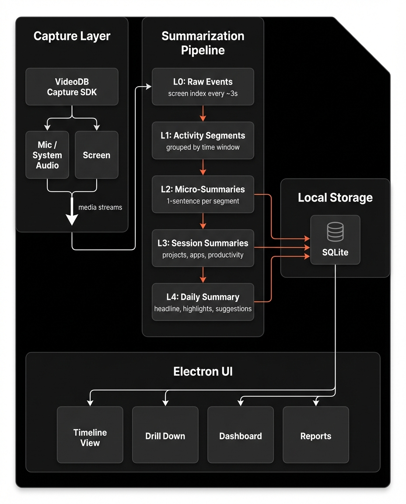

<p align="center">
  
</p>

<h1 align="center">VideoDB Focusd</h1>

<p align="center">
  AI-powered desktop app that records your screen, understands what you're doing, and gives you actionable productivity insights — powered by <a href="https://videodb.io">VideoDB</a>.
</p>

<p align="center">
  <a href="https://artifacts.videodb.io/focusd-productivity-tracker/focusd-productivity-tracker-latest.dmg">Download for macOS</a>
</p>

<p align="center">
  <em>Currently available for macOS — Windows and Linux support coming soon</em>
</p>

---

## Demo

https://github.com/user-attachments/assets/0fb87dfe-eb60-4e1e-9301-6ec01de80a25

---

## Installation (Pre-built App)

If you downloaded the pre-built app from the link above:

1. **Mount the DMG** and drag VideoDB Focusd to your Applications folder

2. **Remove quarantine attributes** to allow the app to run:
   ```bash
   xattr -cr /Applications/VideoDB\ Focusd.app
   ```

3. **Launch the app** from Applications or Spotlight

4. **Grant system permissions** when prompted (Screen Recording is required)

---

## Overview

Focusd records your screen and system audio using VideoDB's real-time capture SDK. It uses vision models to understand what's on your screen every few seconds — which app you're in, what you're reading, what you're coding — and builds a layered summarization pipeline on top of that.

At any point during the day you can:

- See a **live activity timeline** showing what you've been doing and when
- Get **AI-generated session summaries** that tell you exactly what you worked on
- Drill down into any time range for a **detailed breakdown** with app usage, project time, and context
- View a **dashboard** with tracked time, productive time, top applications, and projects
- Generate an **end-of-day recap** with highlights and actionable improvement suggestions

## Architecture



## How summarization works

Raw screen captures flow through a 5-layer pipeline:

1. **Raw events** — VideoDB indexes your screen every few seconds, extracting app names, page titles, visible content
2. **Activity segments** — Events are grouped into time-based chunks
3. **Micro-summaries** — Each segment is summarized by an LLM (what you did, which app, productive or not)
4. **Session summaries** — Micro-summaries roll up into session overviews with app stats and project breakdown
5. **Daily summary** — Everything consolidates into a headline, highlights, and suggestions

All LLM prompts, pipeline timings, and indexing configs live in a single [`config.yaml`](config.yaml) file.

## Features

| Feature | Description |
|---------|-------------|
| **Live Activity Timeline** | Real-time feed of what you're doing, updated every few seconds |
| **Session Summaries** | AI-generated overviews of each work session with app stats and project breakdown |
| **Drill Down** | Select any time range for a detailed breakdown with context |
| **Dashboard** | Tracked time, productive time, top applications, and project distribution |
| **Daily Recap** | End-of-day report with headline, highlights, and improvement suggestions |
| **History View** | Browse past days with full summaries and activity data |
| **Configurable Pipeline** | Tune segment timing, summary intervals, and idle thresholds from Settings |
| **Screen Selector** | Choose which display to capture |

## Tech Stack

| Technology | Purpose |
|------------|---------|
| Electron | Desktop application shell |
| React | UI framework |
| TypeScript | Type safety |
| Tailwind CSS | Styling |
| Recharts | Dashboard charts and visualizations |
| SQLite (better-sqlite3) | Local data storage |
| VideoDB SDK | Screen capture, audio capture, and real-time indexing |
| OpenAI | LLM for summarization pipeline |

## Prerequisites

- **Operating System**: macOS 12+ (Apple Silicon or Intel)
- **Node.js**: 18 or higher
- **npm**: 10 or higher
- **VideoDB API Key**: Sign up at [console.videodb.io](https://console.videodb.io)

## Getting Started

```bash
# 1. Clone the repository
git clone https://github.com/video-db/videodb-capture-quickstart.git
cd videodb-capture-quickstart/apps/electron/focusd-productivity-tracker

# 2. Install dependencies
npm install

# 3. Copy env template and add your VideoDB API key
cp .env.sample .env

# 4. Run in dev mode
npm run dev

# 5. Build macOS DMG
npm run package:mac
```

## Configuration

All prompts, timing intervals, and indexing parameters are in [`config.yaml`](config.yaml). Key settings:

- `pipeline.segment_flush_mins` — how often raw events are grouped into segments
- `pipeline.micro_summary_mins` — how often segments get summarized
- `pipeline.session_summary_mins` — how often session-level summaries are generated
- `pipeline.idle_threshold_mins` — inactivity threshold before pausing tracking

These can also be adjusted from the **Settings** page in the app.

## Project Structure

```
src/
├── main/                         # Electron Main Process
│   ├── services/
│   │   ├── app-tracker.ts        # Application tracking
│   │   ├── capture.ts            # VideoDB capture integration
│   │   ├── config.ts             # Config loading (config.yaml)
│   │   ├── database.ts           # SQLite database layer
│   │   ├── event-ingestion.ts    # Raw event processing (L0)
│   │   ├── idle-detector.ts      # Idle detection
│   │   ├── keystore.ts           # Secure key storage (macOS Keychain)
│   │   ├── logger.ts             # Logging
│   │   └── summarizer.ts         # Summarization pipeline (L1-L4)
│   └── index.ts                  # Main process entry
├── preload/                      # Preload scripts (IPC bridge)
├── renderer/                     # React Frontend
│   └── src/
│       ├── components/
│       │   ├── Timeline.tsx      # Live activity timeline
│       │   ├── TodayView.tsx     # Today's dashboard
│       │   ├── DrillDown.tsx     # Time range drill down
│       │   ├── HistoryView.tsx   # Past day browser
│       │   ├── ReportsView.tsx   # Reports and daily recap
│       │   ├── AppUsageChart.tsx # App usage visualization
│       │   ├── SummaryCard.tsx   # Summary display card
│       │   ├── SettingsView.tsx  # Settings editor
│       │   ├── ScreenSelector.tsx# Display source picker
│       │   ├── Onboarding.tsx    # First-run setup
│       │   ├── Sidebar.tsx       # Navigation sidebar
│       │   └── Layout.tsx        # App layout
│       └── hooks/
│           └── useIPC.ts         # IPC communication hook
└── shared/                       # Shared types
```

## Permissions (macOS)

The app requires the following system permissions:
- **Screen Recording** - For screen capture
- **System Audio Recording** - For capturing system audio (optional)

Grant these in **System Settings > Privacy & Security > Screen Recording**.

## Troubleshooting

### Recording not starting
- Verify VideoDB API key is configured in Settings
- Check Node.js version: `node --version` (requires 18+)
- Grant screen recording permissions in System Settings

### No summaries appearing
- Wait for the first segment flush interval (default: 5 minutes)
- Check that screen indexing is active in the timeline
- Verify your API key has sufficient credits

### App won't launch
- Check for native module issues: `npm run rebuild`
- Delete app data and restart: `rm -rf ~/Library/Application\ Support/VideoDB\ Focusd/`
- Review logs in `~/Library/Application Support/VideoDB Focusd/logs/`

### High CPU usage
- Increase `pipeline.segment_flush_mins` in Settings to reduce indexing frequency
- Disable system audio recording if not needed
- Close other screen recording apps that may conflict

## Data & Privacy

Screen captures are processed through VideoDB's API, and summaries are stored in a local SQLite database at `~/Library/Application Support/VideoDB Focusd/`. Your API key is encrypted using macOS Keychain via Electron's `safeStorage`.

To reset all data:

```
rm -rf ~/Library/Application\ Support/VideoDB\ Focusd/
```
